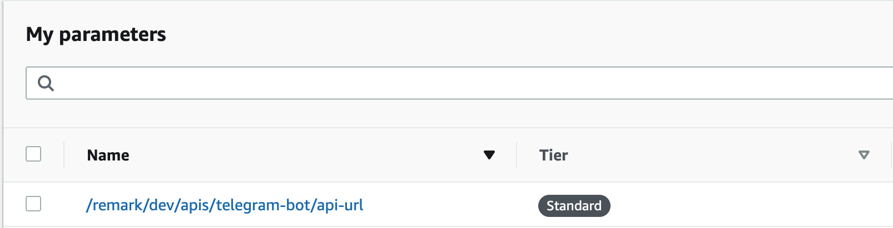
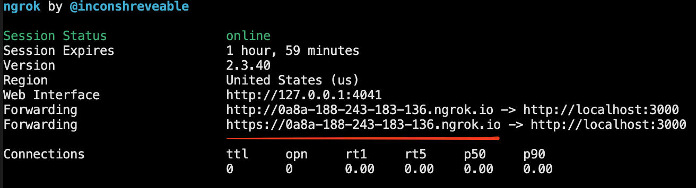

<p align="center" dir="auto">
  
</p>
<p align="center" dir="auto">
  <a href="/LICENSE" >
    
  </a>
  
</p>

---

Mobile client of [Remark](https://github.com/vtcaregorodtcev/remark-extension) (AI-powered bookmark manager) based on telegram messanger. Have the same functionality.

This project is aimed to make Remark even more better allowing creating bookmarks across platforms. Because this project has the same functionality it means we need to deploy [remark-aws-backend](https://github.com/vtcaregorodtcev/remark-extension) first and then use provided api information to setup this telegram bot. Due to this, remark-telegram-bot is not common available bot, it means we also need to deploy this bot before using with unique `TOKEN` gathered from Telegram API program.

## Deploy

This Bot is `AWS-based` and you can deploy it with one command in your terminal. But before you need to create your own telegram bot. Follow [those instructions](https://core.telegram.org/bots) and save TOKEN in safe place, we will use it.

Also we need to configure our Amazon profiles to allow deploying to AWS. [The instructions](https://github.com/vtcaregorodtcev/remark-aws-backend#how) are pretty the same as for [remark-aws-backend](https://github.com/vtcaregorodtcev/remark-aws-backend).

```bash
npx -p @vtcaregorodtcev/remark-telegram-bot -c "TOKEN=your_token npm run deploy"
```

After running this command you should be allowed to set up API config and start creating bookmarks just by dropping messages with links to your deployed bot.

But if there some issue and BOT will not respond you can try to set up it mannualy. For this you need to get path of your deployed bot in [SMM Parameters Store](https://console.aws.amazon.com/systems-manager/parameters)



Just go to this parameter and get it's value. After that run following command.

```bash
npx -p @vtcaregorodtcev/remark-telegram-bot -c "TOKEN=your_token HOOK=your_copied_path npm run set:webhook"
```

In this case everything should work fine.

## Development

This project is under development and you can participate in it. To start this bot locally you anyway need to create a new bot with `Botfather` and get the TOKEN.

Telegram API accepts only https urls as webhooks for their bots, so you need to create https tunnel to your localhost. For this we can use `ngrok` tool and get https url provided by it.

```bash
pnpm start:tunnel
```



After this you can start the serverless in offline mode [`pnpm start`] and set webhook for your local bot. [`TOKEN=your_token HOOK=ngrok_url npm run set:webhook`].

To run serverless in offline mode, your bot should be deployed anyway.
